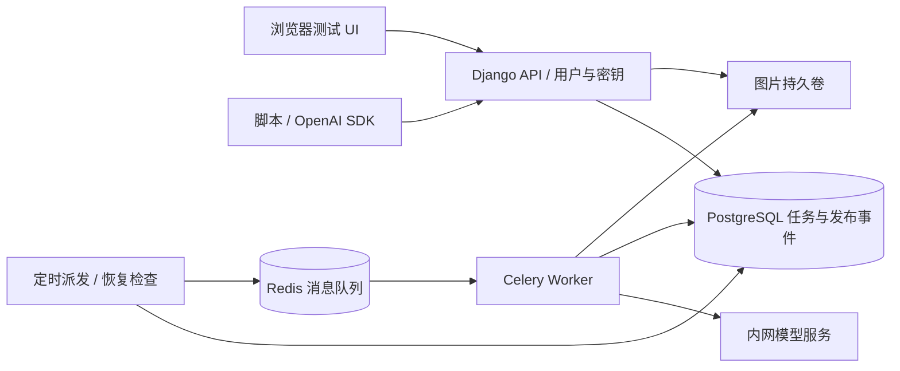

# Diffusion 绘图测试平台：开源选型与最小实例方案

编写日期：2026-10-07。当前目录为空，本次仅做调研和设计，不安装软件、不启动服务、不实现代码。以下接口示例为拟定契约，不代表已有可运行服务；硬件和工期为规划估算。

> 最新架构以 [三层架构与推理服务方案](./方案-三层架构与推理服务.md) 为准：拆分 UI、业务 API、独立同步推理服务，LoRA 为首期必需能力。基础服务使用 Diffusers，无业务状态；业务 Worker 通过 HTTP 调用它。本文第 12 节的 Worker 直接加载模型路线保留为历史备选，不再是当前默认；ComfyUI 不作为依赖。

## 1. 建议先做什么

你的需求可以拆成两个产品功能：**绘图测试 UI**，以及**可生成 API Key 的绘图 API 服务**。两者共用用户、模型配置和异步任务记录。

目前有成熟开源组件可以组合完成，但本次未找到已经验证过、安装后即可完整满足“任意自托管 diffusion 模型 + 用户/API Key + 持久化异步调度 + 自定义测试 UI”的单一方案。

建议按以下条件选择：

| 你的实际情况 | 优先路线 | 需要补的部分 |
|---|---|---|
| 上游已经提供异步绘图 API，且 New API 有对应插件 | **New API + 小型测试 UI** | UI、具体模型参数适配；验证任务生命周期 |
| 已有自托管 ComfyUI，希望最大限度复用现成管理平台 | **New API + ComfyUI 任务插件/适配服务 + 测试 UI** | 插件、图片持久化、GPU 容量限制和故障恢复 |
| 上游只有普通 OpenAI Images 接口，或需要自己控制后台调度 | **Django + Celery + Redis + PostgreSQL + 测试 UI** | 少量业务代码；模型服务可以直接调用现有上游 |
| 还没有模型托管，先跑通完整本地闭环 | 上一行方案 + **Xinference 单模型服务** | 模型配置、输出转换与真实模型测试 |

**本文默认推荐第三条作为可控 MVP，第四条作为自托管最小实例。** 原因是用户明确需要后台调度；不能仅凭“有异步任务页面”就认为网关已经具备自有 GPU 的可靠调度能力。如果确定现有上游命中 New API 插件，优先改用第一条，开发量会更小。

默认规模：内部 1–10 人、单实例、单 GPU 或一个远程模型端点；文生图、每任务一张图、无充值计费、无公开注册。模型和 GPU 尚未指定，因此以 SDXL Base 演示架构，不将其当成最终模型选择。

## 2. 现成方案调研

### 2.1 New API：最接近现成的管理平台

已核实提供用户、API Token、渠道/模型和调用记录管理；适合复用管理控制台。[官方入口](https://docs.newapi.pro/en/docs)

当前文档还有通用任务插件协议：`POST /v1/tasks/{pluginKey}`、任务查询和产物接口；声明图片协议的插件可提供 `/v1/images/generations`。图片兼容接口会等待结果，异步任务接口另行返回任务 ID。[插件调用指南](https://docs.newapi.pro/zh/docs/plugins/usage)

适配限制：插件支持哪些模型和参数需要逐项确认。检索本次官方插件索引未找到 `comfy`，不能据此承诺 ComfyUI 开箱即用，也不能据此断言社区没有相关适配。[官方插件索引](https://raw.githubusercontent.com/QuantumNous/new-api-plugins/main/index.json)

采用它之前做四个验证：目标发布版本是否含任务插件；目标后端有没有匹配插件；是否能重启后恢复查询与产物；队列是否能约束到每 GPU 一个执行任务。文档能力与具体已发布镜像的能力必须分别确认，不能使用浮动 `latest` 代替验证。

适合用户/密钥管理占主要需求的场景。自托管模型的排队、取消、幂等和持久化仍需验证或补充，不能把“定期查询上游任务”当作“定期从本地队列派发任务”。许可按最终选定版本的 [LICENSE](https://github.com/QuantumNous/new-api/blob/main/LICENSE) 核对。

### 2.2 ComfyUI：工作流和 LoRA 测试优先

自托管服务有 `/prompt` 提交、`/history/{prompt_id}` 查询、`/view` 获取图片和 WebSocket 进度。适合调采样器、LoRA、ControlNet 和多节点工作流。[服务端路由文档](https://docs.comfy.org/development/comfyui-server/comms_routes)

它的原生 API 不是 OpenAI Images 协议。应作为内网执行器，外面加任务与认证层。执行历史和队列不能直接作为业务任务数据库。只开放审核过的工作流模板，不让普通用户提交任意节点图。

### 2.3 Xinference：标准模型 API 优先

提供 OpenAI 兼容文生图 `/v1/images/generations` 和模型启动管理，适合将受支持的模型作为服务托管；具体模型、LoRA、量化与引擎支持取决于选定版本。[图片能力文档](https://inference.readthedocs.io/en/latest/models/model_abilities/image.html)

这是本文默认的自托管执行器。其模型管理 UI 不代替本产品的用户任务 UI；业务异步队列仍在外层。输出必须适配为客户端能访问的地址或 Base64，不能把容器内文件路径原样返回。

### 2.4 LiteLLM：以后做多供应商路由时再考虑

支持图片生成调用及 Virtual Keys。它适合统一多个模型供应商的鉴权、路由与用量管理；本次没有将其视为已验证的通用持久化绘图任务系统。[图片接口](https://docs.litellm.ai/docs/image_generation)、[Virtual Keys](https://docs.litellm.ai/docs/proxy/virtual_keys)

只有一个绘图后端时，同时引入 LiteLLM 和 New API 没有必要。不同管理功能的社区/商业版本边界需在选型时验证。

## 3. 推荐 MVP 的组件与职责

| 组件 | 使用现成能力 | 本项目负责 |
|---|---|---|
| Django 5.2 LTS + Django REST Framework | 用户认证、Session、Admin、ORM、API 序列化 | Task、ApiKey、ModelEndpoint 业务模型与接口 |
| Django 模板 + 少量 JavaScript | 页面渲染 | 提交表单、轮询任务、图片列表；首期不另建 SPA |
| Celery | 后台执行、消息消费、重试机制 | 调用模型、状态更新、异常分类 |
| Redis | Celery 消息代理 | 配置持久化；不作为任务最终事实来源 |
| PostgreSQL | 持久化与事务 | 用户、任务、发布事件、模型配置、图片元数据 |
| Xinference / ComfyUI / 已有上游 API，三选一 | 模型推理 | 一个适配器，隔离不同后端协议 |
| 本地持久卷 | 图片文件 | 文件命名、授权下载、保留期；多机后再换 S3 兼容存储 |

Django 自带认证及管理后台，避免重新实现密码和用户后台；Celery 提供标准 Worker，但业务任务状态仍由本项目保存。[Django 认证](https://docs.djangoproject.com/en/5.2/topics/auth/)、[Celery Tasks](https://docs.celeryq.dev/en/stable/userguide/tasks.html)



不引入 Kubernetes、独立身份平台、支付系统、消息流平台或多 GPU 调度框架。每种组件只承担一个清楚的职责；Django Web 和 Worker 使用同一个业务镜像。

## 4. “异步生成”与 OpenAI 兼容如何共存

这里要分清：Python `async/await` 是编程方式；持久化后台任务是产品能力，两者不能互相替代。

普通 OpenAI Images 生成调用返回图片结果；“返回 task_id 后轮询”的接口是我们额外设计的扩展，不能宣称它能原样供 `client.images.generate()` 使用。[OpenAI Images 参考](https://developers.openai.com/api/reference/resources/images)

因此共用同一任务系统，提供两种入口：

| 接口 | 行为 | 用途 |
|---|---|---|
| `POST /api/v1/image-tasks` | 持久化后立即 `202 Accepted`，返回 ID | 测试 UI、异步脚本，默认入口 |
| `GET /api/v1/image-tasks/{id}` | 返回状态、结果和错误 | 轮询 |
| `GET /api/v1/image-tasks` | 仅列出本人任务，分页 | 任务历史 |
| `POST /api/v1/image-tasks/{id}/cancel` | 首期仅取消尚未派发任务 | 取消排队 |
| `POST /v1/images/generations` | 创建同类任务并等待，成功返回 `created/data` | OpenAI SDK 兼容子集 |
| `GET /v1/models` | 列出可用模型别名 | API 客户端发现模型 |
| `GET /api/v1/artifacts/{id}/content` | 鉴权下载，或签发短期 URL | 访问图片 |

首期兼容 `model`、`prompt`、`n=1`、`size`、`response_format=url/b64_json`；仅公布实际支持的尺寸。不要将别的模型的 `quality`、`style` 等字段静默忽略。未知字段或不支持值返回明确 400；参数兼容不表示生成效果与 OpenAI 模型相同。

`seed`、`steps`、`guidance_scale`、`negative_prompt` 等属于本平台扩展；按模型能力开放。SDK 可用 `extra_body` 传扩展，普通用户使用 UI 高级参数。图生图、编辑、多图和流式预览放第二阶段。

同步等待设可配置上限，例如 180 秒；反向代理超时略长。等待超时返回错误并附任务关联 ID（扩展字段/响应头），原任务继续运行，不能返回伪成功。调用方按任务 ID 查询，或用同一幂等键重试。SDK 自动重试未带幂等键时可能产生重复任务，应在调用说明中关闭或约束。

### 异步调用示例（拟定接口）

```http
POST /api/v1/image-tasks
Authorization: Bearer ig_...
Idempotency-Key: demo-cat-001
Content-Type: application/json

{
  "model": "sdxl-base",
  "prompt": "一只坐在窗边的橘猫，柔和自然光",
  "size": "1024x1024",
  "n": 1,
  "seed": 42,
  "steps": 25
}
```

```json
{"id":"task_demo_001","status":"queued","poll_after_ms":2000}
```

查询成功后：

```json
{
  "id":"task_demo_001",
  "status":"succeeded",
  "result":{"data":[{"url":"https://images.example/api/v1/artifacts/art_demo/content?token=SHORT_LIVED"}]},
  "parameters":{"model":"sdxl-base","seed":42,"steps":25,"size":"1024x1024"},
  "timing":{"queue_ms":1000,"inference_ms":25000}
}
```

示例时间仅示意字段，不是性能承诺。固定 seed 便于比较，但跨硬件、引擎和版本不承诺逐像素一致。

## 5. 后台定时派发与任务可靠性

按照你提出的“后台定时任务送给模型”，首期采用：**请求先落库，后台每 1–2 秒扫描待派发事件，投递 Celery，Worker 调模型**。不使用每分钟 cron 作为主派发机制，避免无谓排队延迟。

派发器是同业务镜像的一个独立常驻进程，内部按间隔执行；若希望全用 Celery Beat，可由单实例 Beat 触发专用调度 Worker，但要增加一个调度队列，避免长时间绘图阻塞调度。两种方式选一种。周期任务需要防止重叠执行。[Celery 周期任务](https://docs.celeryq.dev/en/stable/userguide/periodic-tasks.html)

推荐状态：`queued → dispatching → running → succeeded / failed`；另有 `cancelled` 和 `unknown`。`unknown` 表示已可能提交上游但结果不可确定，不等同于可以安全重试。

关键约束：

1. **落库与发消息一致性**：同一数据库事务写 Task 和 Outbox 发布事件；派发器成功发消息后标记事件。发布后标记前崩溃可能重复发消息，因此 Worker 必须按 task_id 原子抢占。只用 `transaction.on_commit()` 发消息仍有故障窗口。
2. **GPU 并发**：首期每 GPU/后端一个专属队列，一个 Worker 执行槽；prefetch=1。若其他服务也可调用同一 GPU，必须在执行器侧统一限流，不能只依赖本平台 Worker 数。
3. **定时扫描互斥**：单派发器也使用事务抢占/租约，为后续扩容保留边界。多实例可用 PostgreSQL `FOR UPDATE SKIP LOCKED` 处理队列表；不要在数据库事务中等待推理。[PostgreSQL SELECT](https://www.postgresql.org/docs/current/sql-select.html)
4. **请求幂等**：`(user_id, idempotency_key)` 唯一，保存请求摘要。同键同内容返回原任务，同键不同内容返回 409；并发提交也要满足约束。
5. **恢复边界**：异步上游保存 provider_task_id，恢复后查上游；普通同步 Images API 如果连接断开，可能不知道是否已经生成，标为 unknown，停止自动再次生成。仅在确认未提交或后端支持幂等时自动重试。不能承诺跨服务 exactly-once。
6. **租约与心跳**：记录执行 owner、attempt、heartbeat 和租约；超时进入恢复检查。旧 Worker 的结果需用 attempt/fencing 校验，避免覆盖新执行记录。租约过期本身不代表 GPU 已空闲。
7. **重试分类**：请求参数错误不重试；明确未接受的限流/暂时故障可退避重试，建议最多 2 次；OOM 不无限重试，记录模型和尺寸并恢复执行器。取消运行中的任务先不支持，避免误中断其他任务。
8. **产物持久化**：先写临时文件，校验后原子移动，再将 Task 标成功。对重试复用稳定产物键；孤立文件定期清理。数据库只存元数据，不塞大块 Base64。
9. **背压**：默认每用户最多 5 个未完成任务、全局最多 50 个；超额返回 429。具体数值随测试调整。接口请求限流和在途任务限额分别处理。

Celery 消息确认与重投能帮助恢复，但不会自动让模型调用幂等。Redis 开启持久化，任务恢复仍以 PostgreSQL 为准；Redis 可丢失并重建消息，而不能丢失任务记录。

## 6. 首期必做：浏览器绘图测试 UI 与用户管理

**交付必须同时包含可直接操作的绘图测试网页和可供程序调用的 API。** 用户登录后即可在网页生成图片，不需要自己写请求、使用 Swagger 或先创建 API Key。管理后台只负责管理；绘图页是面向测试用户的独立页面，与 API 在同一阶段交付。

用户只分管理员和普通用户。管理员创建/停用账号、重置密码和配置模型；关闭公开注册。管理员直接使用 Django Admin，普通用户不进入管理后台。

API Key 由用户自行创建/撤销，完整值仅首次显示，保存前缀和不可逆摘要，包含所属用户、状态、创建/到期时间和最后使用时间；停用用户同时阻止其密钥调用。使用成熟密码哈希库处理登录密码，API Key 用密码学随机数生成，不使用密码派生密钥。

浏览器用 HttpOnly Session Cookie 和 CSRF 防护；脚本用 Bearer API Key。浏览器不需要长期保存 API Key，更不能拿到上游模型服务密钥。所有任务、图片和重试/取消操作校验所有权；OpenAI 的 `user` 请求字段不可作为权限依据。

首期页面只要四个：

- 登录页。
- 绘图页：模型、prompt、尺寸、seed、steps；提交后轮询，显示排队/生成/失败及图片。
- 任务页：历史、完整参数、错误、排队耗时、推理耗时、下载、复用参数；未知进度显示状态，不编造百分比。
- 密钥页：创建、列出、撤销。

### 6.1 绘图主页面布局

桌面端采用左侧参数、右侧结果的布局，手机端上下排列。默认打开绘图页；任务历史和 API Key 管理通过顶部导航进入。

```text
┌─────────────────────────────────────────────────────────────┐
│ 绘图测试                  任务历史    API Keys    当前用户    │
├───────────────────────┬─────────────────────────────────────┤
│ 模型 [sdxl-base    ▼]  │ 当前任务：生成中                    │
│                       │ 排队耗时 / 生成耗时                 │
│ 提示词                │                                     │
│ [多行输入框        ]  │ ┌─────────────────────────────────┐ │
│ [                  ]  │ │                                 │ │
│                       │ │           图片预览区            │ │
│ 尺寸 [1024×1024   ▼]  │ │                                 │ │
│                       │ └─────────────────────────────────┘ │
│ ▸ 高级参数            │ [查看大图] [下载] [复用参数]         │
│ Seed / Steps / CFG    │                                     │
│                       │ 最近任务：缩略图、状态、提交时间    │
│ [     生成图片     ]  │ [图片1] [图片2] [排队中] [失败]     │
└───────────────────────┴─────────────────────────────────────┘
```

这是规划线框，不是已实现页面。Seed、Steps、CFG 和负面提示词仅在所选模型支持时显示；默认收起高级参数，基本操作只需要选模型、填提示词、点生成。

### 6.2 一次生成的完整交互

1. 登录后加载可用模型与支持尺寸；没有可用模型时显示原因并禁用提交。
2. 用户填写提示词，点击“生成图片”。提交期间防止重复点击，并为本次提交生成幂等键。
3. 收到任务 ID 后立即显示“排队中”，每约 2 秒查询一次状态；随后显示“生成中”。只有后端提供可靠进度时才显示百分比。
4. 成功后显示图片，可点击看大图、下载原图、查看本次实际参数。首次加载失败时可重新加载产物，不重新生成。
5. 失败显示简明错误及任务 ID；“重新生成”明确创建新任务。“复用参数”只填回表单，由用户再次点击生成。
6. 页面刷新或关闭后重新打开，可从任务历史恢复查看；不能把任务状态只保存在浏览器内存。

生成期间仍可编辑下一次提示词；当前结果对应的参数快照独立展示，避免把新输入误认为旧图参数。用户可以在限额内提交多个任务，但服务端仍按单 GPU 并发限制排队。

### 6.3 首期 UI 范围与选型约束

首期包含文生图、任务状态、结果预览/下载、最近记录、复用参数和密钥管理。图生图上传、多图对比、参数批量扫描、画布编辑和节点编辑器留到后续。

默认用 Django 模板与少量 JavaScript 实现，同域调用业务 API，避免为简单 UI 增加独立前端服务。UI 和外部 API 共用任务创建与权限逻辑；浏览器使用 Session 身份，外部脚本使用 API Key。

如果最终选择 New API，同样必须交付上述简单绘图页。选型验证要实际检查其现有 Playground 是否满足目标模型参数、异步状态和图片历史；若不满足就补独立测试页，并验证登录集成。仅部署管理控制台或提供 API 文档不算完成 UI 需求。

UI 验收标准：一个不会调用 API 的测试用户，可以在网页内完成“登录 → 填提示词 → 提交 → 查看状态 → 看图/下载 → 从历史复用参数”，全程不需要终端或开发者工具。

模型配置记录模型别名、后端类型、内网地址、允许参数、上限及实际模型修订版本。任务保存参数快照、模型/工作流版本与实际 seed，后续改配置不改变历史任务含义。

数据表最小集合：Django User/Session、ApiKey、ModelEndpoint、Task、TaskAttempt、Artifact、Outbox。日志记录 task_id、attempt、错误类型和耗时；不记录完整密钥。

## 7. 模型托管需要什么

### 已有 OpenAI 兼容上游

本平台不需要 GPU。准备模型 base_url、上游密钥、模型名、支持参数、限流/超时规则、输出形式和费用规则。Worker 调上游并持久化结果，即可给使用者提供异步体验。

如果供应商本来就是 submit/status/result 三段式 API，直接写该协议适配器；不要为“内部也必须 OpenAI 兼容”多包一层等待接口。OpenAI 兼容是对外产品契约，执行层可以采用更适合恢复的协议。

### 自托管 GPU

需要模型权重及准确 revision、VAE/文本编码器/LoRA 等依赖、推理引擎、兼容的 NVIDIA 驱动与 PyTorch/CUDA 容器组合、持久化权重缓存及产物盘、就绪检查、GPU 监控和内网连通性。Linux + NVIDIA GPU 是本文部署基线；当前 Windows 工作区可以编写项目，实际推理用 Linux GPU 主机或验证后的 WSL2 GPU 环境。

以下是**保守选机起点，不是已经测出的最低要求，也不是采购承诺**：

| 场景 | GPU 规划起点 | 其他资源 | 说明 |
|---|---|---|---|
| 仅远程 API 调用 | 无 | 2–4 vCPU、4–8 GB RAM、20 GB+ 磁盘 | 不含大规模图片留存 |
| SDXL Base、1024²、单张 | 12–16 GB 显存起测；24 GB 留余量 | 8 vCPU、32 GB RAM、100 GB SSD 可用 | 首期不用 refiner；精度/offload 要实测 |
| 更大 DiT、复杂编辑/多模型 | 先在 24/48/80 GB 档位租机验证 | 64 GB+ RAM，按权重扩盘 | 不能仅按“diffusion”一词推定显存 |

SDXL Base 可以独立使用，适合做服务闭环的样例。[模型卡](https://huggingface.co/stabilityai/stable-diffusion-xl-base-1.0)

显存不仅是权重大小，还包括文本编码器、VAE、激活、注意力和工作区；量化与 CPU offload 可降低部分显存需求，但改变速度或数值行为，应记录到测试元数据。[Diffusers 内存优化](https://huggingface.co/docs/diffusers/optimization/memory)

先租用或使用已有 GPU 运行固定参数样例，记录冷启动、热启动 P50/P95、显存峰值与错误率，再决定购买。不要现在锁定云厂商和价格。容量用实测估算：单卡每小时理论上限约 `3600 / 单任务平均秒数`，还需留排队和系统余量；例如 30 秒只是算例，对应理论 120 张/小时，不是本模型的已测性能。

图片磁盘预算：`每天图片数 × 平均图片大小 × 保留天数`，另加权重、数据库与备份。默认保留 7 天可调，删除文件后保留任务元数据并标记产物过期。软件许可和模型权重许可分开记录，具体模型用途以其模型卡和许可为准。

## 8. 一个明确的最小部署实例

目标：一台 Linux GPU 主机，1 个管理员、2 个测试用户，SDXL Base，1024×1024，n=1，单 GPU 并发 1。下面是部署拓扑，不是已经生成的 compose 文件。

| 服务进程/容器 | 实例数 | 暴露范围 |
|---|---:|---|
| web：Django UI/API/Admin | 1 | 本机演示绑定 localhost；对外经 HTTPS 代理 |
| dispatcher：扫描 Outbox 与恢复检查 | 1 | 无公开端口 |
| worker：Celery 调模型 | 1 | 无公开端口 |
| postgres | 1 | 内网 |
| redis | 1 | 内网 |
| inference：Xinference + 单个常驻模型 | 1 | 内网；只给该容器 GPU |

三个业务进程复用同一个镜像，总计六个容器；接远程模型时减掉 inference，五个容器且无需 GPU。演示图片存本机卷，Web 与 Worker 挂载相同产物卷；模型缓存、数据库和 Redis 使用独立持久卷。对外服务再加一个 HTTPS 反向代理。

未来配置项至少包括：数据库连接、Redis 连接、应用密钥、公开访问地址、模型后端地址和密钥、模型别名映射、产物根目录、超时、排队上限、保留天数。密钥来自环境或 Secret 文件，不提交到 Git；业务用户不能修改上游地址，避免任意 URL 抓取。

启动顺序：数据库与迁移 → 初始化管理员 → 模型下载与加载 → 实际小图预热/就绪 → Worker 与派发器 → Web。模型进程端口可访问不代表权重已经加载完成。

演示验收流程：登录 → 创建 API Key → UI 提交一张图 → 查看 queued/running/succeeded → 下载 → 用 Key 提交异步任务 → 用 OpenAI SDK 调兼容入口 → 另一用户无法查看前者任务/图片 → 撤销 Key 后请求被拒绝。

首期只验证一个推理后端，其他适配器不要同时开发。若主要测试 LoRA/工作流，则把 Xinference 换为 ComfyUI，并在适配器保存 prompt_id、轮询历史、复制产物；Web/API 层不变。

## 9. 若采用 New API，最小方案如何变化

已有匹配异步插件时：浏览器测试页 → New API（用户、密钥、任务）→ 上游模型服务。用 New API 自有的任务契约，不同时维护本文 Django Task 契约；尽量复用它的用户和密钥控制台，不额外创建一套用户数据库。

自托管 ComfyUI 时：先做一个插件/适配器验证，将模型参数映射到固定工作流并提供状态、产物映射。需实测插件宿主版本、响应格式、网络超时、图片权限、重启恢复，以及后端队列容量。若必须增加完整持久化调度服务，New API 的主要价值就变为用户/渠道管理，组件数未必比 Django 路线少。

**选型门槛**：限定半天到一天验证目标后端能否在 New API 完成“提交—查询—下载—重启恢复”。通过则优先复用；不通过则采用本文自有任务层。这里是建议的时间盒，不是已完成测试，也不保证一定能在一天内适配。

## 10. 实施阶段与验收标准

以下为熟悉 Python/Docker 的单人估算，不包含陌生模型兼容问题和下载等待：

| 阶段 | 产出 | 粗略工期 |
|---|---|---|
| 0：模型/平台验证 | 锁定模型、后端、GPU 和版本；验证 New API 适配价值 | 0.5–1 天 |
| 1：核心闭环 | 登录、API Key、异步任务、Worker、产物下载 | 2–3 天 |
| 2：测试 UI 与兼容接口 | 四个页面、SDK 冒烟、参数记录 | 1–2 天 |
| 3：恢复与部署 | 幂等、Outbox、背压、故障验证、部署说明 | 1–2 天 |

内部可用 MVP 约 5–8 个工作日作为排期起点。New API 命中现成插件可能更短；自定义工作流和复杂模型可能更长。

必须验收：

- API 收到任务后无需等待推理即可返回；刷新页面后还能查到任务。
- 并发请求保持单 GPU 执行限制；队列满返回明确错误。
- 重复消息和同幂等键提交不会产生第二个业务任务；未知上游执行结果不会盲目重试。
- Web、Worker、Redis 重启分别验证；恢复可确认的任务，无法确认的进入 unknown 并可人工处理。
- 生成成功后图片可读取；失败有可定位原因；过期产物给出明确状态。
- 用户隔离覆盖列表、详情、取消、图片下载；停用账号和撤销密钥立即生效。
- 使用真实 OpenAI SDK 测试已声明兼容字段及错误行为，不能只用 curl 就宣称 SDK 兼容。
- 用真实目标模型记录基准性能与显存，并确定任务超时、保留期及每用户限额。

## 11. 后续实现前需要确定的输入

不影响这份方案成立，但会改变最终配置：

1. 模型名称、revision、是否测试 LoRA/自定义 checkpoint/图生图。
2. 已有上游 API 还是需要 GPU 自托管；如果已有上游，需要一份实际请求/响应样例。
3. GPU 型号/显存、部署机器系统及能否访问模型下载源。
4. 预计用户数、峰值任务量、可接受排队时间。
5. 仅内网使用还是要公网访问；图片保留时间。

在这些输入未知时，默认按“内部小团队、单模型单 GPU、普通文生图、管理后台复用 Django、异步队列复用 Celery、推理复用 Xinference”推进后续设计。以上所有官方链接均为本次调研来源，部署时需锁定实际验证的版本与镜像摘要。

## 12. 收敛方案：直接使用 Diffusers，不需要 ComfyUI

根据后续明确的需求，如果只做 SDXL 或 Qwen-Image-2.1 类模型的生成测试，最少只需一个推理库和一套完整模型组件。ComfyUI 是工作流应用，不是运行这些模型的必要条件；Xinference 也可以省略。

### 12.1 最小模型组件集合

| 模型 | 必要权重组件 | 另需配置文件 | 首期可省略 |
|---|---|---|---|
| SDXL Base | UNet、两个文本编码器、VAE | Tokenizer、scheduler、pipeline 配置 | Refiner、LoRA、ControlNet、放大/人脸修复模型 |
| Qwen-Image-2.1 | DiT、配套 Qwen3-VL 编码器、配套 VAE | Tokenizer/processor、scheduler、pipeline 配置 | 独立提示词改写模型、额外增强模型 |

“只部署一个模型”指一套完整 pipeline，不能只下载 UNet/DiT 那一个文件。两个系列的组件不能随意混用。最省心的方式是下载对应的完整 Diffusers 模型仓库并固定 revision，而不是自己拼接散装权重。

SDXL 使用 `StableDiffusionXLPipeline`，Base 本身可以完成文生图，Refiner 是可选增强。[SDXL 官方 pipeline 文档](https://huggingface.co/docs/diffusers/api/pipelines/stable_diffusion/stable_diffusion_xl)

Qwen-Image-2.1 官方提供 `QwenImage21Pipeline` 使用方式，并区分生成模型与可选的提示词改写模型；直接输入 prompt 即可生成。[Qwen 官方仓库](https://github.com/QwenLM/Qwen-Image-2.1)、[Diffusers Qwen-Image-2.1 文档](https://github.com/huggingface/diffusers/blob/main/docs/source/en/api/pipelines/qwenimage21.md)

Qwen 的文本编码器是生成链路的必要部分，不等于可选的提示词改写服务。不能因只做文生图就删掉配套编码器，也不能只按视觉生成部分的参数量估算全部显存。

### 12.2 最小推理软件集合

使用 Python、PyTorch、Diffusers、Transformers、Accelerate、Pillow 及模型加载所需依赖，由包管理器锁定完整依赖。两种模型共用推理框架，分别使用各自的 pipeline 类。

本次查到 Qwen 官方快速开始仍给出从 Git 安装 Diffusers 的方式。实际实现时先验证包含 `QwenImage21Pipeline` 的发布版；若需源码版，锁定验证过的 commit，并固定 Transformers/PyTorch 配套版本，不让部署随 main 自动更新。[官方安装与样例](https://github.com/QwenLM/Qwen-Image-2.1#quick-start)

### 12.3 保留全部产品需求的最小架构

```text
简单绘图网页 / 外部 API 客户端
              ↓
Django Web：登录、API Key、任务接口、图片预览
              ↓
PostgreSQL：任务与 Outbox → 定时派发器 → Redis
                                            ↓
                            单 GPU Celery Worker
                              直接调用 Diffusers
                                            ↓
                                  图片持久卷 + 任务结果
```

相比第 8 节删掉 inference 容器，把模型加载放进 GPU Worker，变成五个服务进程/容器：Web、派发器、Worker、PostgreSQL、Redis。推理无需经过内部 HTTP，也不必在 GPU Worker 再提供一套 OpenAI API；由 Web 统一提供对外兼容入口。

Worker 启动后加载一套 pipeline 并常驻，串行处理任务，不能每次请求重新加载权重。Web 和派发器不加载 CUDA。Celery GPU Worker 采用单执行槽，例如验证后的 `solo` 模式，并在 Worker 进程内初始化模型，避免 CUDA 初始化后再 fork；需要强制终止卡死推理时由进程监管重启并执行任务恢复检查，不能假定 solo 池具备所有进程池超时能力。

首期常驻一个模型即可。需要比较 SDXL 与 Qwen 时保留两份权重，但单卡默认只加载一套；更换模型要等当前任务结束再卸载/加载。若需要同时稳定服务两个模型，分别配置 GPU Worker 和队列，不默认两套模型能同时放进同一张卡。

第 5 节的可靠性设计仍适用。直接推理没有上游 task_id；若 Worker 崩溃且尚未写入可验证产物，任务进入恢复检查。确认旧进程已退出后，才允许有界重跑；按 attempt 防止旧结果覆盖新结果，承认一次 GPU 计算可能需要重新执行。

### 12.4 还能否缩减服务数

只有单人出图验证时，可以做一个简单页面加 Diffusers 的临时演示，省掉持久化队列和管理模块。但这不覆盖此前要求的用户、API Key 和可恢复异步任务，因此不作为本项目交付方案。

保留所有需求也可用 PostgreSQL 队列表加单独 GPU Worker，去掉 Celery/Redis，让 Worker 定时抢占任务，缩成 Web、数据库、Worker 三个服务。不过需要自行实现租约、重试与恢复，维护工作更多。考虑“尽量使用标准开源组件”，首期仍推荐五服务的 Celery 版本；如果最少部署组件比复用队列更重要，再选择三服务版本。

**本次结论：UI/API + 成熟任务队列 + Diffusers GPU Worker 是更贴合当前范围的方案；无需 ComfyUI，也无需额外模型服务平台。** 目前仅更新设计，尚未对具体 GPU 完成安装、出图与性能验证。
